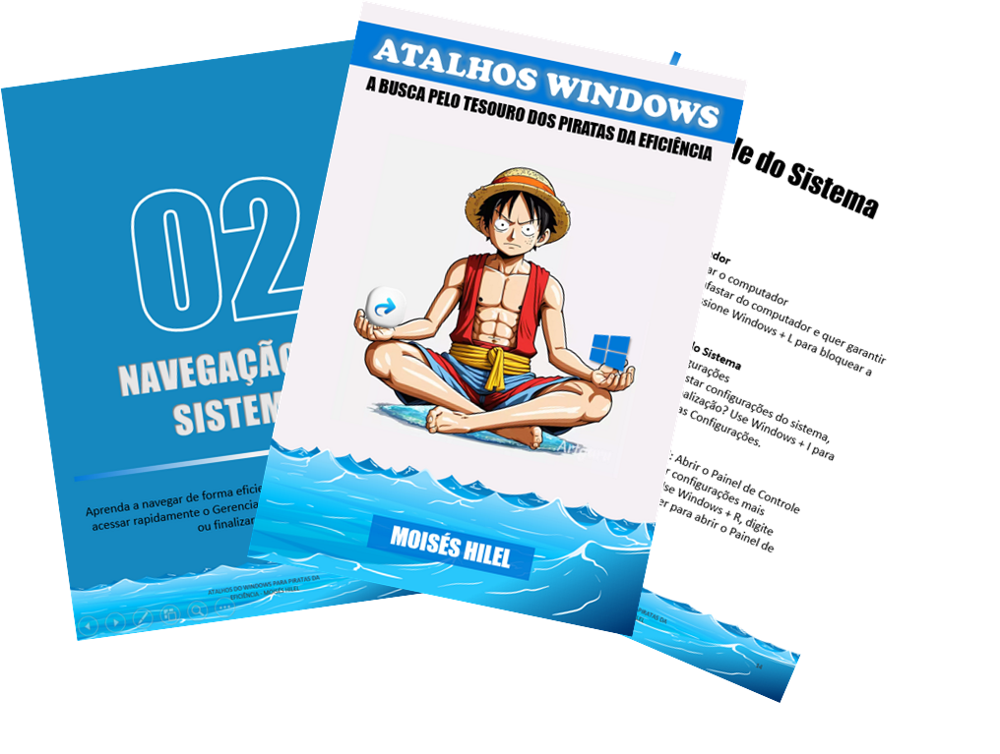

    

-------

# Projeto EBOOK Gerado por I.A.s

 > ℹ️ **NOTE:** Este é o repositório desenvolvido durante o curso no qual fui instrutor técnico na plataforma da [DIO](https://dio.me)

Projeto com o objetivo de gerar um ebook digital com as facilidades das ferramentas de IA. todos os prompts
seguem abaixo.

<a href="https://github.com/moiseshilel/atalhos_windows/blob/main/output/Ebook.pdf" title="View PDF now"> 📕Clique aqui para ler</a> 

## 💻 Tecnologias utilizadas no projeto

- [ChatGPT](https://chat.openai.com/) 
- [ArtGuru](https://www.artguru.ai/)
- [PowerPoint](https://www.microsoft.com/en/microsoft-365/powerpoint)

## 🧠 Prompts

ChatGPT：

|   Ação   | prompt                                                                                                                                                                                                                                                                         |
| :------: | ------------------------------------------------------------------------------------------------------------------------------------------------------------------------------------------------------------------------------------------------------------------------------ |
|  título  | Crie um título de um ebook sobre o tema de css, o ebookk é do nicho de programação e o subnicho é de css, o título deve ser épico e curto, e tenha uma temática de star wars no título, me liste 5 variações de títulos                                                        |
| conteúdo | Faça um texto para ebook , com foco em CSS, listando os principais seletores CSS com exemplos em código {REGRAS} Explique sempre de uma maneira simples Deixe o texto enxuto, Sempre traga exemplos de código em contextos reais , sempre deixe um título sugestivo por tópico |

ArtGuru：

|  Ação  | prompt                                                                                 |
| :----: | -------------------------------------------------------------------------------------- |
| título | a luffy in meditation pose |

## ✨ Features

- Conteúdo gerado via ChatGPT
- Imagens geradas via ArtGuru

## 📚 Materiais

- Imagens utilizadas em `assets`

## 🛠️ Instruções de execução

Utilize os prompts acima nas ferramentas sugeridas para gerar o material base e utilize uma ferramenta de edição de documentos como power point, libreoffice , indesign para diagramação.

## 👨‍💻 Expert

    
    
&nbsp&nbsp&nbspFelipe Aguiar 
    &nbsp&nbsp&nbsp
    <a href="https://github.com/moiseshilel">
    GitHub</a>&nbsp;|&nbsp;
    <a href="www.linkedin.com/in/
mhilel-developer">LinkedIn</a>
&nbsp;|&nbsp;
    <a href="https://www.instagram.com/moiseshilel/">
    Instagram</a>
&nbsp;|&nbsp;

  

---

⌨️ com 💜 por [Moises Hilel](https://github.com/moiseshilel)